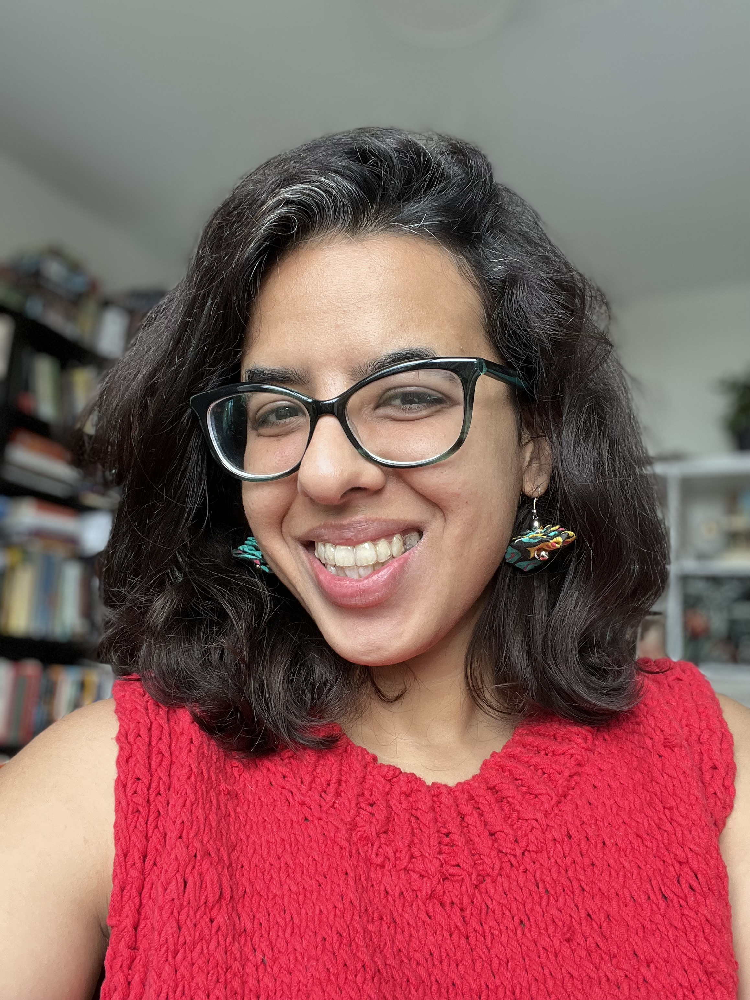
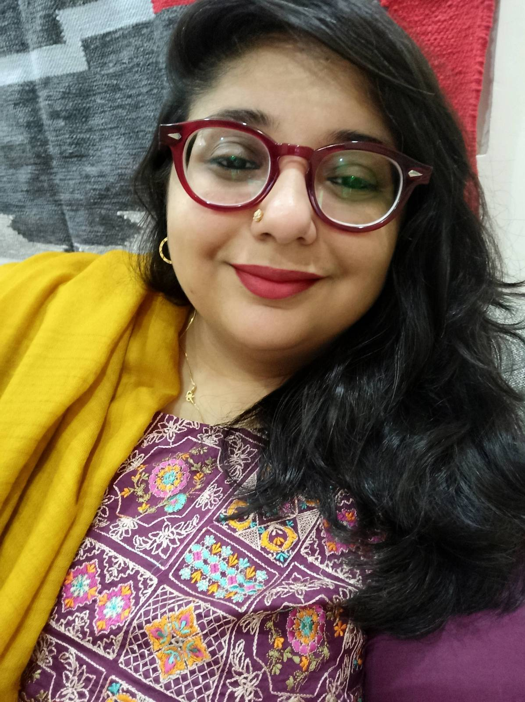

**Saba Imtiaz** is a writer and independent journalist. Her debut novel *Karachi, You’re Killing Me!* (Penguin Random House India, 2014) was adapted into the Indian film *Noor* (2017). Her nonfiction work focuses on culture, food, religion, and urban life. She was raised in Karachi, Pakistan, and has reported features from Pakistan, Afghanistan, Jordan, and Lebanon. Her work has appeared in the *Guardian, Marie Claire, Roads & Kingdoms*, and on the *BBC*. She is a recipient of fellowships from the International Women’s Media Foundation and the International Reporting Project. She lives in The Netherlands. Her work can be found [here](https://sabaimtiaz.com).

- [Twitter: @sabaimtiaz](https://twitter.com/sabaimtiaz)
- [Instagram: @sabaimtiaz](https://instagram.com/sabaimtiaz)

**Tooba Masood-Khan** is a communications specialist and freelance journalist based in Karachi, Pakistan. She has worked at news media organizations in Pakistan for over thirteen years. Her reporting has been featured on the *BBC, fiftytwo, NPR, Dawn, HuffPost India*, and *Samaa*. She has also worked with *Al Jazeera, LA Times*, and *Aks Films*. Her writing ranges from covering the elections, documenting Karachi’s history and building regulations, to longform work on sexual harassment at the workplace, and writing about women’s health in the country. She was short-listed for the Zeenat Haroon Rashid writing prize in 2020.

- [Instagram: @tabahi_tooba](https://instagram.com/tabahi_tooba)
- [Twitter: @tabahitooba](https://twitter.com/tabahitooba)

## Contact
- Email [Saba Imtiaz](mailto:saba@mm.st)
- Email [Tooba Masood](mailto:masoodtooba@gmail.com)
- For publishing inquiries, contact [The Wylie Agency](https://www.wylieagency.com/)

