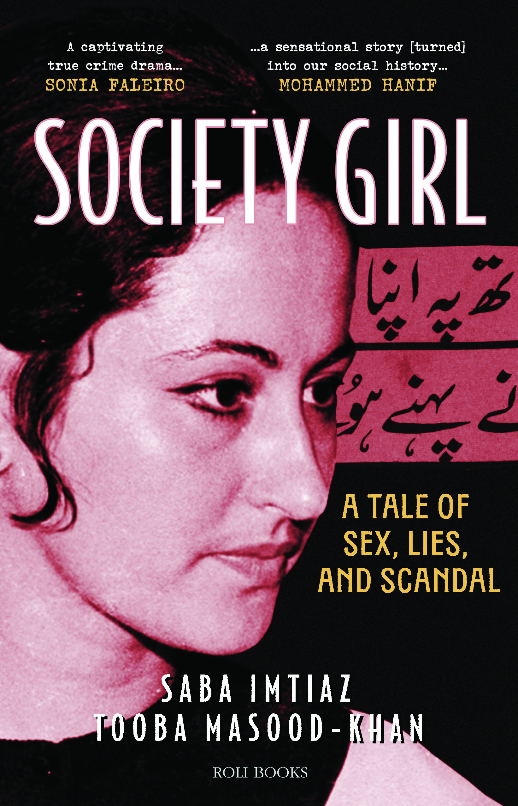

## Society Girl: A Tale of Sex, Lies, and Scandal
On an October morning in 1970, phones began ringing all over Karachi. The charismatic young poet and former civil servant Mustafa Zaidi had been found dead in his bedroom. He wasn’t alone: Shahnaz Gul, a stunningly beautiful, married socialite, with whom Zaidi had been having an affair, was lying unconscious in the next room, seemingly drugged. 

The ensuing scandal would shake Pakistani society, becoming a fixture on the front pages of newspapers even as the country went from one cataclysmic event to another. It grew to include obsession, revenge porn, the involvement of influential politicians and businessmen, and even a smuggling ring. 

But two autopsies, several investigations, and one trial later – no one was able to answer what exactly happened in that bedroom, and how Mustafa Zaidi ended up dead. 

Over fifty years later, [authors Saba Imtiaz and Tooba Masood-Khan](/about_authors.html) attempt to answer this question in Society Girl. Their retelling of, and years-long investigation into this story of twisted motives and murderous intentions, of it-girls and playboys, of class and culture, and a press out for blood and salaciousness, led to a far more complex tale than anyone could have possibly imagined.

