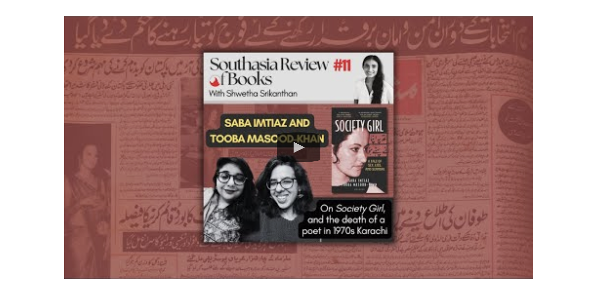

## Reviews

[Open Magazine - Fault Lines in Karachi](https://openthemagazine.com/lounge/books/fault-lines-in-karachi/)

[Dawn - Society Girl: A Tale of Sex, Lies and Scandal revisits one of Pakistan’s most intriguing cold cases](https://images.dawn.com/news/1192993/book-review-society-girl-a-tale-of-sex-lies-and-scandal-revisits-one-of-pakistans-most-intriguing-cold-cases)

[Dunya - A Scandal for the Pages](https://dunyadigital.co/feature_40.html)

[The Friday Times - A Homemaker And A Poet Fall In Love: What Could Possibly Go Wrong?](https://thefridaytimes.com/23-Nov-2024/a-homemaker-and-a-poet-fall-in-love-what-could-possibly-go-wrong)

## Features 

[The Times of India - The Sex Scandal Pakistan Never Forgot](https://timesofindia.indiatimes.com/toi-plus/international/why-pakistan-is-still-obsessed-with-this-sex-scandal-from-1970/articleshow/115939121.cms)

[BBC Urdu - Karachi 'high society' ka scandal jo aik purisrar maut par khatam hua](https://www.bbc.com/urdu/articles/c9wlj5v7gd0o)

## Interviews

[Maati TV - Writing about a Karachi 70s Murder Mystery - Out of the Box](https://www.youtube.com/watch?v=v0Qajgmxnww)
<iframe width="560" height="315" src="https://www.youtube.com/embed/v0Qajgmxnww?si=E3l164RFA95FBQOp" title="YouTube video player" frameborder="0" allow="accelerometer; autoplay; clipboard-write; encrypted-media; gyroscope; picture-in-picture; web-share" referrerpolicy="strict-origin-when-cross-origin" allowfullscreen></iframe>

[BBC Hindi - Pakistan के इतिहास की सबसे चर्चित और रहस्यमयी मौत की कहानी -विवेचना](https://www.youtube.com/watch?v=Q4hqR3I2PR8)
<iframe width="560" height="315" src="https://www.youtube.com/embed/Q4hqR3I2PR8?si=ws0dbKtVrw3d6Zft" title="YouTube video player" frameborder="0" allow="accelerometer; autoplay; clipboard-write; encrypted-media; gyroscope; picture-in-picture; web-share" referrerpolicy="strict-origin-when-cross-origin" allowfullscreen></iframe>

[Dawn News English - Let's Talk About Female Authors & True Crime](https://youtu.be/DiqevnzF52s?feature=shared)
<iframe width="560" height="315" src="https://www.youtube.com/embed/DiqevnzF52s?si=7iW-OrtyvbGyyHhi" title="YouTube video player" frameborder="0" allow="accelerometer; autoplay; clipboard-write; encrypted-media; gyroscope; picture-in-picture; web-share" referrerpolicy="strict-origin-when-cross-origin" allowfullscreen></iframe>

[Himalistan - Southasia Review of Books Podcast](https://www.himalmag.com/podcast/society-girl-sex-lies-scandal-karachi-pakistan-media-1970-mustafa-zaidi-shahnaz-gul)

## Excerpts

- ['A new book investigates poet Mustafa Zaidi’s death, still a subject of controversy in Pakistan' - Scroll.in](https://scroll.in/article/1075239/) 
- ['The death that shook 1970s’ Pakistan' - The Tribune](https://www.tribuneindia.com/news/book-reviews/the-death-that-shook-1970s-pakistan)

## Columns

- [Mahnaz Rahman: Shahnaz aur Mustafa Zaidi Ki Kahani - Hum Sab](https://www.humsub.com.pk/571228/mahnaz-rahman-152/) 

## Roundups

- [Harper's Bazaar](https://www.harpersbazaar.in/culture/story/books-to-read-if-you-are-looking-for-an-adrenaline-rush-this-season-1135631-2024-12-10)

- [Indian Express](https://indianexpress.com/article/books-and-literature/books-to-read-greatest-cooking-show-galaxy-9662662/)

- [Hindustan Times](https://www.hindustantimes.com/books/ht-picks-new-reads-101729262610531.html)

- [Live Mint Lounge](https://www.livemint.com/mint-lounge/art-and-culture/new-book-releases-october-2024-11729152512682.html)

## Book Events

- [Revisiting the story of Mustafa Zaidi’s death and Shahnaz Gul - Dawn](https://www.dawn.com/news/1876055/revisiting-the-story-of-mustafa-zaidis-death-and-shahnaz-gul)

- [Decades old murder mystery retold - Dawn](https://www.dawn.com/news/1874587/decades-old-murder-mystery-retold)

- [Society Girl revisits gripping 1970 case of Mustafa Zaidi - The News](https://www.thenews.com.pk/print/1254414-society-girl-revisits-gripping-1970-case-of-mustafa-zaidi)

